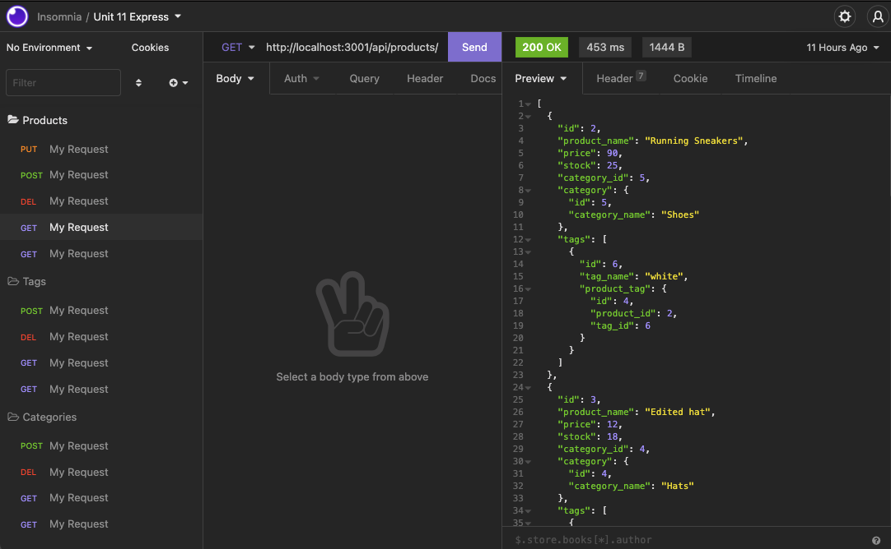

# E-commerce Backend

Title: E-commerce Backend

Developer: Francis Bond

Deployment Date: Mar 2, 2022

For: UT Coding Bootcamp

Published: GitHub 

Built with: Node.js, MySql, Insomnia, Express, sequilize

## Summary

This application lets you manipulate a database through calls on the database.

## Development

As a Dev I was tasked with writing models that matched our seeds. I was also tasked in writing the correct routes for the database manipulation.

https://drive.google.com/file/d/1yfnHE--ZtCRPopkz162hy6TfNkgfWWKh/view